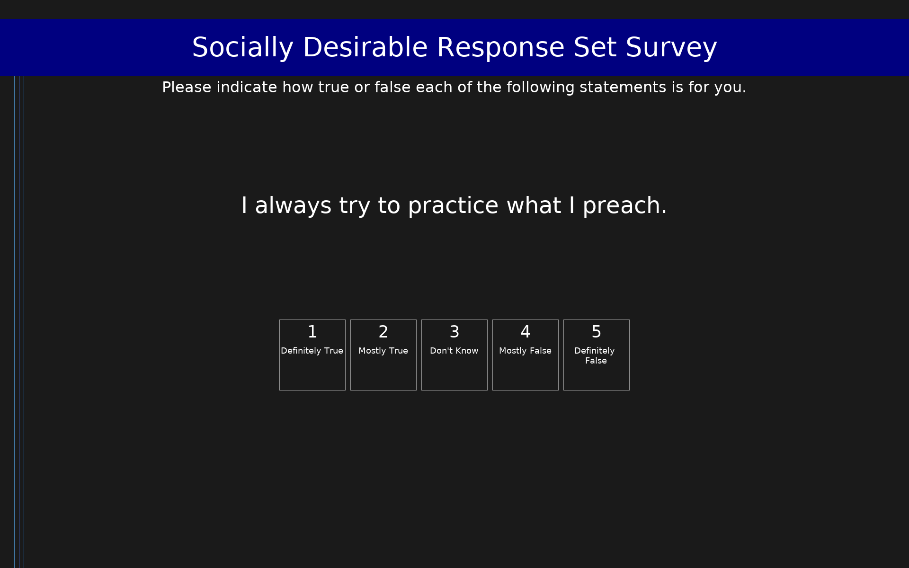

# Socially Desirable Response Set Survey (SDRS-5)

A 5-item scale measuring the tendency to give socially desirable responses. Used as a methodological covariate to identify response bias in self-report surveys.

## Overview

- **Code:** `SDRS5`
- **Items:** 0
- **Languages:** en
- **Version:** 1.0
- **License:** Public Domain (RAND)

## Dimensions

| ID | Name | Description |
|----|------|-------------|
| `sdrs` | Social Desirability | Tendency to give socially desirable responses. Higher scores indicate greater socially desirable responding. |

## Questions

## Scoring

- **sdrs**: sum_coded (5 items)
  - Sum of coded item responses. Items sdrs1 and sdrs5 are positive/forward-keyed statements; a response of 'Definitely True' (1) reflects high desirability and is reverse-coded (coding = -1) so that higher raw scores map to higher desirability. Items sdrs2, sdrs3, and sdrs4 are negative statements; 'Definitely False' (5) reflects high desirability and are scored as-is (coding = +1). Score range: 5–25. Higher scores indicate stronger socially desirable responding. No clinical norms; intended as a methodological covariate.

## Citation

Hays, R. D., Hayashi, T., & Stewart, A. L. (1989). A five-item measure of socially desirable response set. Educational and Psychological Measurement, 49(3), 629–636. https://doi.org/10.1177/001316448904900121

**URL:** https://doi.org/10.1177/001316448904900121

## Files

- `SDRS5.en.json`
- `SDRS5.json`
- `screenshot.png`

---
*This README was auto-generated by `tools/generate_readmes.py`.*
