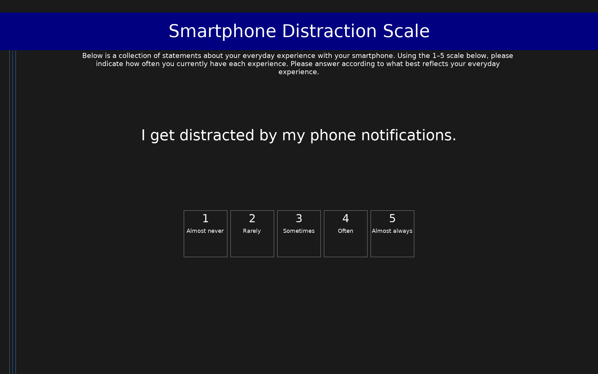

# Smartphone Distraction Scale (SDS)

16-item self-report scale measuring smartphone distraction across four dimensions: Attention Impulsiveness (distraction from notifications and the device itself), Online Vigilance (cognitive preoccupation with checking content and social validation), Multitasking (simultaneous smartphone use during other activities), and Emotion Regulation (using the phone to manage negative affect and avoid unpleasant tasks). Higher scores indicate greater smartphone distraction.

## Overview

- **Code:** `SDS`
- **Items:** 0
- **Languages:** en
- **Version:** 1.0
- **License:** CC BY 4.0

## Dimensions

| ID | Name | Description |
|----|------|-------------|
| `attention` | Attention Impulsiveness | Distraction caused by impulsive responses to phone notifications, apps, and the mere physical presence of the device. |
| `vigilance` | Online Vigilance | Cognitive preoccupation with checking phone content and monitoring social media for likes, comments, and posts. |
| `multitasking` | Multitasking | Using the smartphone simultaneously while engaged in other activities such as conversations, walking, or working. |
| `emotion_reg` | Emotion Regulation | Using the smartphone as a distraction strategy to avoid unpleasant tasks, negative thoughts, or emotional pressure. |

## Questions

## Scoring

- **attention**: mean_coded (4 items)
  - Mean of Attention Impulsiveness items (1–5). Higher scores indicate greater distraction from smartphone notifications, apps, and device presence.
- **vigilance**: mean_coded (4 items)
  - Mean of Online Vigilance items (1–5). Higher scores indicate greater preoccupation with checking phone content and monitoring social validation.
- **multitasking**: mean_coded (4 items)
  - Mean of Multitasking items (1–5). Higher scores indicate more frequent simultaneous smartphone use during other activities.
- **emotion_reg**: mean_coded (4 items)
  - Mean of Emotion Regulation items (1–5). Higher scores indicate greater use of the smartphone to avoid unpleasant tasks, negative thoughts, or emotional pressure.

## Citation

Throuvala, M. A., Pontes, H. M., Tsaousis, I., Griffiths, M. D., Rennoldson, M., & Dhuffar, M. K. (2021). Exploring the dimensions of smartphone distraction: Development, validation, measurement invariance, and latent mean differences of the Smartphone Distraction Scale (SDS). Frontiers in Psychiatry, 12, 642634.

**URL:** https://doi.org/10.3389/fpsyt.2021.642634

## Files

- `SDS.en.json`
- `SDS.json`
- `screenshot.png`

---
*This README was auto-generated by `tools/generate_readmes.py`.*
