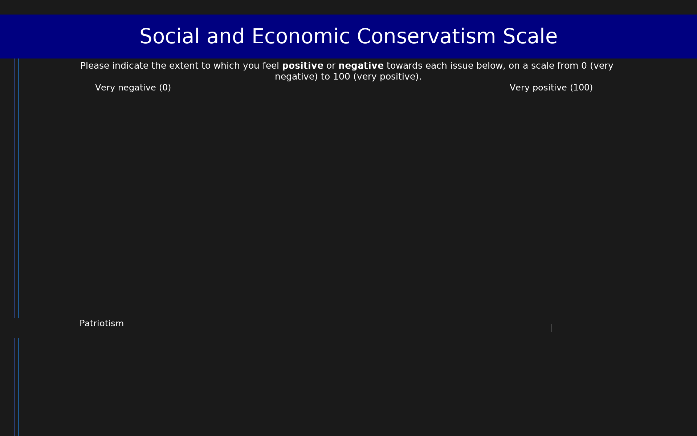

# Social and Economic Conservatism Scale (SECS)

12-item measure of social and economic conservatism using feeling thermometer ratings (0-100). Higher composite scores indicate greater conservatism.

## Overview

- **Code:** `SECS`
- **Items:** 0
- **Languages:** en
- **Version:** 1.0
- **License:** CC0 (Public Domain)

## Dimensions

| ID | Name | Description |
|----|------|-------------|
| `conservatism` | Social and Economic Conservatism |  |

## Questions

## Scoring

- **conservatism**: mean_coded (12 items)
  - Mean of items after reverse-coding Abortion and Welfare benefits (0-100). Divide by 10 for 0-10 scale. Higher = more conservative.

## Citation

Everett, J. A. C. (2013). The 12 item Social and Economic Conservatism Scale (SECS). PLoS ONE, 8(12), e82131. https://doi.org/10.1371/journal.pone.0082131

**URL:** https://doi.org/10.1371/journal.pone.0082131

## Files

- `README.md`
- `SECS.en.json`
- `SECS.json`
- `screenshot.png`

---
*This README was auto-generated by `tools/generate_readmes.py`.*
