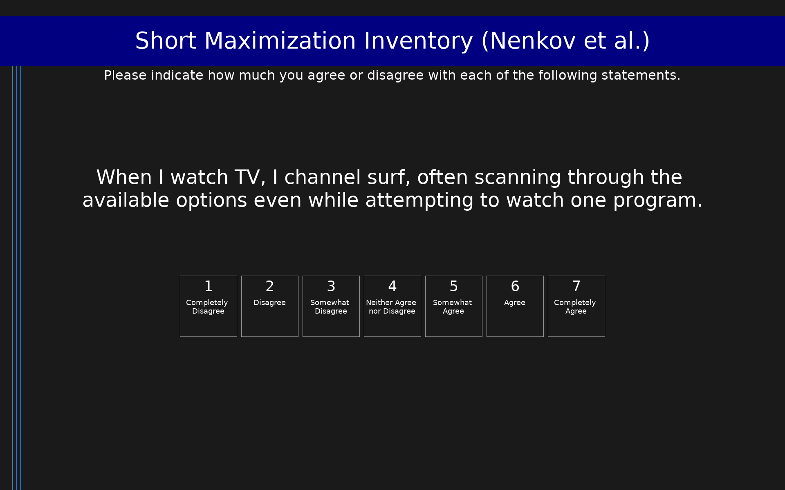

# Short Maximization Inventory (Nenkov et al.) (SMI)

9-item shortened version of the Schwartz et al. (2002) Maximization Scale with three subscales: Alternative Search (3 items), Decision Difficulty (3 items), and High Standards (3 items). Developed through factor-analytic reduction of the original 13-item scale. The three subscales should be examined separately rather than summed into a total score. Items use a 7-point completely disagree to completely agree scale.

## Overview

- **Code:** `SMI`
- **Items:** 0
- **Languages:** en
- **Version:** 1.0
- **License:** CC BY 4.0

## Dimensions

| ID | Name | Description |
|----|------|-------------|
| `alt_search` | Alternative Search |  |
| `decision_difficulty` | Decision Difficulty |  |
| `high_standards` | High Standards |  |

## Questions

## Scoring

- **alt_search**: mean_coded (3 items)
  - Mean of Alternative Search items (1-7). Higher scores indicate a greater tendency to seek out all possible alternatives before deciding. Corresponds to items 1, 2, and 4 of the original Schwartz et al. (2002) 13-item scale.
- **decision_difficulty**: mean_coded (3 items)
  - Mean of Decision Difficulty items (1-7). Higher scores indicate greater experienced difficulty when making decisions. Corresponds to items 7, 8, and 9 of the original Schwartz et al. (2002) 13-item scale.
- **high_standards**: mean_coded (3 items)
  - Mean of High Standards items (1-7). Higher scores indicate higher personal standards and expectations for oneself and one's choices. Corresponds to items 11, 12, and 13 of the original Schwartz et al. (2002) 13-item scale.

## Citation

Nenkov, G. Y., Morrin, M., Ward, A., Schwartz, B., & Hulland, J. (2008). A short form of the Maximization Scale: Factor structure, reliability and validity studies. Judgment and Decision Making, 3(5), 371-388.

**URL:** https://journal.sjdm.org/8323/jdm8323.pdf

## Files

- `SMI.en.json`
- `SMI.json`
- `screenshot.png`

---
*This README was auto-generated by `tools/generate_readmes.py`.*
