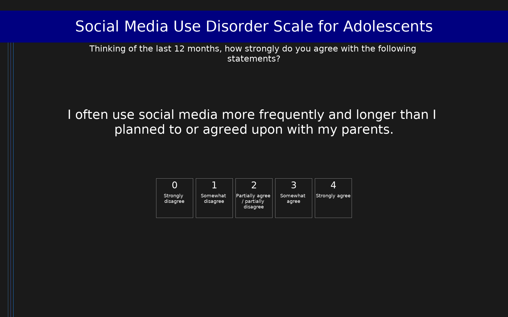

# Social Media Use Disorder Scale for Adolescents (SOMEDIS-A)

9-item ICD-11-based self-report scale assessing social media use disorder in adolescents aged 10–17 years, adapted from the Gaming Disorder Scale for Adolescents (GADIS-A). Items cover impaired control, prioritization over other activities, and continuation despite negative consequences. Sum scores ≥ 13 indicate probable social media use disorder.

## Overview

- **Code:** `SOMEDIS`
- **Items:** 0
- **Languages:** en
- **Version:** 1.0
- **License:** CC BY 4.0

## Dimensions

| ID | Name | Description |
|----|------|-------------|
| `disorder` | Social Media Use Disorder | Sum score of all 9 items (0–36). Scores ≥ 13 indicate probable social media use disorder. |

## Questions

## Scoring

- **disorder**: sum_coded (9 items)
  - Sum of all 9 items (0–36). Scores ≥ 13 indicate probable social media use disorder. Two-factor structure: Factor 1 (negative consequences: items 3, 5, 6, 7, 8, 9) and Factor 2 (cognitive-behavioral symptoms: items 1, 2, 4).

## Citation

Paschke, K., Austermann, M. I., Simon-Kutscher, K., & Thomasius, R. (2021). ICD-11-Based Assessment of Social Media Use Disorder in Adolescents: Development and Validation of the Social Media Use Disorder Scale for Adolescents. Frontiers in Psychiatry, 12, 661483.

**URL:** https://doi.org/10.3389/fpsyt.2021.661483

## Files

- `SOMEDIS.en.json`
- `SOMEDIS.json`
- `screenshot.png`

---
*This README was auto-generated by `tools/generate_readmes.py`.*
