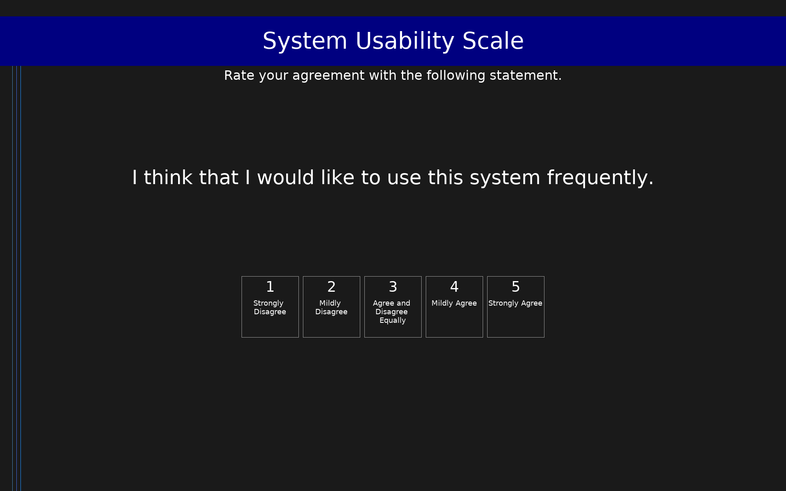

# System Usability Scale (SUS)

10-item scale measuring perceived system usability. Traditional SUS score (0-100) = 25 * (mean_coded - 1).

## Overview

- **Code:** `SUS`
- **Items:** 0
- **Languages:** en
- **Version:** 1.0
- **License:** Free to use (no known copyright restrictions)

## Dimensions

| ID | Name | Description |
|----|------|-------------|
| `usability` | System Usability | Overall perceived usability. Traditional SUS score (0-100) = 25 * (mean - 1). |

## Questions

## Scoring

- **usability**: mean_coded (10 items)
  - Mean usability score (1-5 scale). Traditional SUS (0-100) = 25 * (mean - 1).

## Citation

Brooke, J. (1996). SUS: A 'Quick and Dirty' Usability Scale. In P. W. Jordan, B. Thomas, I. L. McClelland, & B. Weerdmeester (Eds.), Usability Evaluation in Industry (pp. 189-194). https://doi.org/10.1201/9781498710411

**URL:** https://doi.org/10.1201/9781498710411

## Files

- `README.md`
- `SUS.en.json`
- `SUS.json`
- `screenshot.png`

---
*This README was auto-generated by `tools/generate_readmes.py`.*
