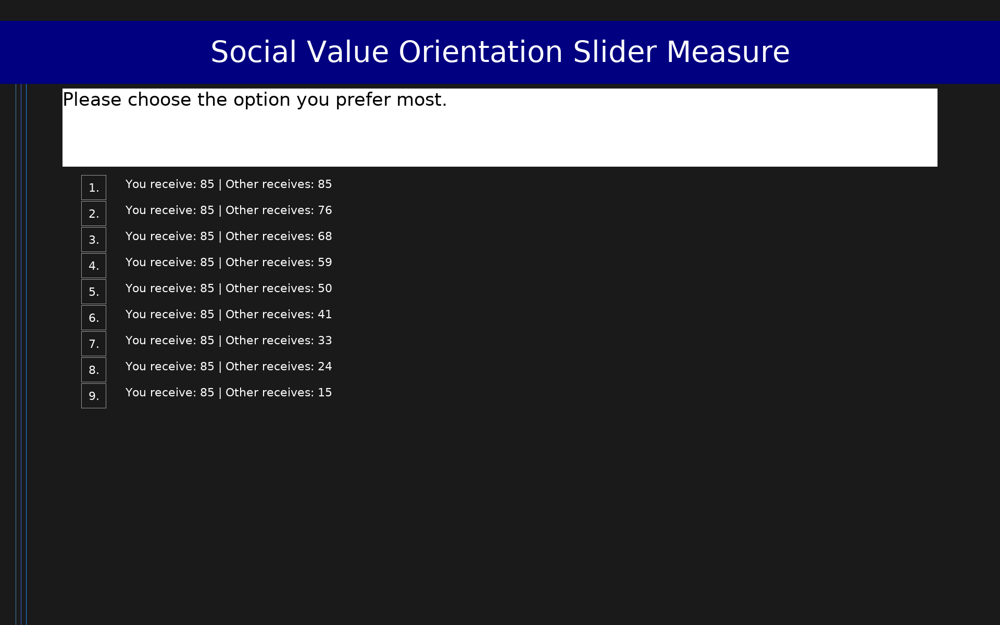

# Social Value Orientation Slider Measure (SVO)

15-item measure of social value orientation assessing the degree to which individuals value outcomes for others relative to themselves. Six primary items yield an SVO angle classifying respondents as altruistic (>57.15°), prosocial (22.45° to 57.15°), individualistic (-12.04° to 22.45°), or competitive (<-12.04°). Nine optional secondary items further distinguish inequality aversion from joint gain maximization among prosocial respondents.

## Overview

- **Code:** `SVO`
- **Items:** 0
- **Languages:** en
- **Version:** 1.0
- **License:** CC BY 4.0

## Dimensions

| ID | Name | Description |
|----|------|-------------|
| `svo_angle` | SVO Angle | Computed as arctan(mean_other / mean_self) × (180/π) using the Self and Other payoffs from the chosen option on each primary item. Range: approximately -90° to +90°. Classification thresholds: Altruistic > 57.15°; Prosocial 22.45° to 57.15°; Individualistic -12.04° to 22.45°; Competitive < -12.04°. Cannot be computed from a simple sum; raw response values (e.g., '85_85') must be parsed to extract Self and Other payoffs. See Murphy et al. (2011) for the full scoring procedure. |
| `inequality_aversion` | Inequality Aversion | Mean normalized distance between selected allocations and the equality-maximizing option across the 9 secondary items. Meaningful only for prosocial respondents (SVO angle 22.45° to 57.15°). Requires parsing raw response values to extract Self and Other payoffs. See Murphy et al. (2011) and the secondary-items tutorial for the scoring procedure. |
| `joint_gain` | Joint Gain Maximization | Mean normalized distance between selected allocations and the joint-gain-maximizing option across the 9 secondary items. Meaningful only for prosocial respondents (SVO angle 22.45° to 57.15°). Requires parsing raw response values to extract Self and Other payoffs. See Murphy et al. (2011) and the secondary-items tutorial for the scoring procedure. |

## Questions

## Scoring

- **svo_angle**: sum_coded (6 items)
  - The SVO angle cannot be computed from a simple coded sum. Raw response values (e.g., '85_85') must be parsed to extract Self (S_i) and Other (O_i) payoffs for each primary item i. SVO angle = arctan(mean(O_1..O_6) / mean(S_1..S_6)) × (180/π). Classification: Altruistic > 57.15°; Prosocial 22.45° to 57.15°; Individualistic -12.04° to 22.45°; Competitive < -12.04°. See Murphy, Ackermann, & Handgraaf (2011) for the full scoring procedure.
- **inequality_aversion**: sum_coded (9 items)
  - Inequality aversion score computed from the 9 secondary items. For each secondary item, compute the normalized distance between the chosen allocation and the equality-maximizing allocation (where Self = Other). Average across all 9 items. Only interpretable for respondents classified as prosocial on the primary items. Raw response values must be parsed to extract Self and Other payoffs. See Murphy et al. (2011) and the secondary-items tutorial (https://ryanomurphy.com/resources/SVO_second_item_tutorial.pdf) for the full scoring procedure.
- **joint_gain**: sum_coded (9 items)
  - Joint gain maximization score computed from the 9 secondary items. For each secondary item, compute the normalized distance between the chosen allocation and the joint-gain-maximizing allocation (where Self + Other is largest). Average across all 9 items. Only interpretable for respondents classified as prosocial on the primary items. Raw response values must be parsed to extract Self and Other payoffs. See Murphy et al. (2011) and the secondary-items tutorial (https://ryanomurphy.com/resources/SVO_second_item_tutorial.pdf) for the full scoring procedure.

## Citation

Murphy, R. O., Ackermann, K. A., & Handgraaf, M. J. J. (2011). Measuring Social Value Orientation. Judgment and Decision Making, 6(8), 771-781.

**URL:** https://doi.org/10.1017/S1930297500004204

## Files

- `SVO.en.json`
- `SVO.json`
- `screenshot.png`

---
*This README was auto-generated by `tools/generate_readmes.py`.*
