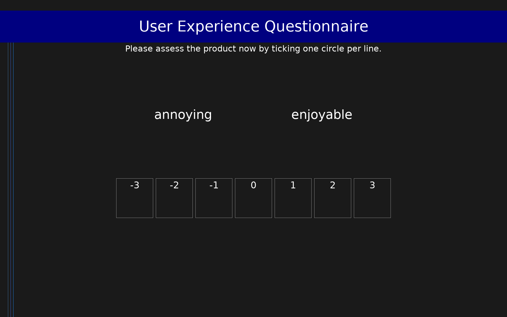

# User Experience Questionnaire (UEQ)

26-item semantic differential scale measuring user experience across 6 dimensions: Attractiveness, Perspicuity, Efficiency, Dependability, Stimulation, and Novelty.

## Overview

- **Code:** `UEQ`
- **Items:** 0
- **Languages:** ar, bg, bn, bs, cs, da, de, el, en, es, et, fa, fi, fr, he, hi, hr, hu, id, it, ja, kn, ko, mr, ms, nb, nl, pl, pt, ru, sk, sl, sv, ta, th, tr, zh
- **Version:** 1.0
- **License:** Free for all purposes

## Dimensions

| ID | Name | Description |
|----|------|-------------|
| `attractiveness` | Attractiveness |  |
| `perspicuity` | Perspicuity |  |
| `efficiency` | Efficiency |  |
| `dependability` | Dependability |  |
| `stimulation` | Stimulation |  |
| `novelty` | Novelty |  |

## Questions

## Scoring

- **attractiveness**: mean_coded (6 items)
- **perspicuity**: mean_coded (4 items)
- **efficiency**: mean_coded (4 items)
- **dependability**: mean_coded (4 items)
- **stimulation**: mean_coded (4 items)
- **novelty**: mean_coded (4 items)

## Citation

Laugwitz, B., Held, T., & Schrepp, M. (2008). Construction and evaluation of a user experience questionnaire. In A. Holzinger (Ed.), HCI and Usability for Education and Work, LNCS 5298 (pp. 63-76). Springer.

**URL:** https://www.ueq-online.org/

## Files

- `UEQ.ar.json`
- `UEQ.bg.json`
- `UEQ.bn.json`
- `UEQ.bs.json`
- `UEQ.cs.json`
- `UEQ.da.json`
- `UEQ.de.json`
- `UEQ.el.json`
- `UEQ.en.json`
- `UEQ.es.json`
- `UEQ.et.json`
- `UEQ.fa.json`
- `UEQ.fi.json`
- `UEQ.fr.json`
- `UEQ.he.json`
- `UEQ.hi.json`
- `UEQ.hr.json`
- `UEQ.hu.json`
- `UEQ.id.json`
- `UEQ.it.json`
- `UEQ.ja.json`
- `UEQ.json`
- `UEQ.kn.json`
- `UEQ.ko.json`
- `UEQ.mr.json`
- `UEQ.ms.json`
- `UEQ.nb.json`
- `UEQ.nl.json`
- `UEQ.pl.json`
- `UEQ.pt.json`
- `UEQ.ru.json`
- `UEQ.sk.json`
- `UEQ.sl.json`
- `UEQ.sv.json`
- `UEQ.ta.json`
- `UEQ.th.json`
- `UEQ.tr.json`
- `UEQ.zh.json`
- `screenshot.png`

---
*This README was auto-generated by `tools/generate_readmes.py`.*
