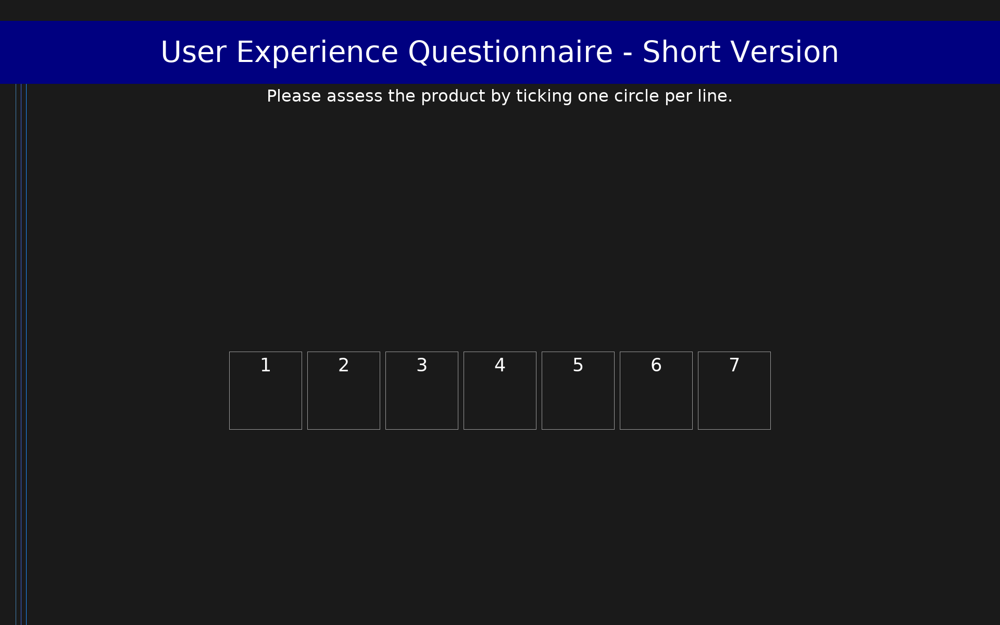

# User Experience Questionnaire - Short Version (UEQ-S)

8-item short version of the User Experience Questionnaire measuring pragmatic and hedonic quality of interactive products using semantic differential items on a 7-point scale (-3 to +3).

## Overview

- **Code:** `UEQS`
- **Items:** 0
- **Languages:** ar, bg, bn, bs, cs, da, de, el, en, es, et, fa, fi, fr, he, hi, hr, hu, id, it, ja, kn, ko, mr, ms, nb, nl, pl, pt, ru, sk, sl, sv, ta, th, tr, zh
- **Version:** 1.0
- **License:** Free to use (authors provide translations openly at ueq-online.org)

## Dimensions

| ID | Name | Description |
|----|------|-------------|
| `pragmatic_quality` | Pragmatic Quality | Task-oriented quality aspects: supportiveness, ease of use, efficiency, clarity |
| `hedonic_quality` | Hedonic Quality | Non-task-oriented quality aspects: excitement, interest, inventiveness, novelty |
| `overall` | Overall UX | Overall user experience score across all items |

## Questions

## Scoring

- **pragmatic_quality**: mean_coded (4 items)
  - Mean pragmatic quality score (1-7 scale). Subtract 4 for standard UEQ -3 to +3 scale.
- **hedonic_quality**: mean_coded (4 items)
  - Mean hedonic quality score (1-7 scale). Subtract 4 for standard UEQ -3 to +3 scale.
- **overall**: mean_coded (8 items)
  - Overall UX score (1-7 scale). Subtract 4 for standard UEQ -3 to +3 scale.

## Citation

Schrepp, M., Hinderks, A., & Thomaschewski, J. (2017). Design and Evaluation of a Short Version of the User Experience Questionnaire (UEQ-S). International Journal of Interactive Multimedia and Artificial Intelligence, 4(6), 103-108. https://doi.org/10.9781/ijimai.2017.09.001

**URL:** https://www.ueq-online.org/

## Files

- `UEQS.ar.json`
- `UEQS.bg.json`
- `UEQS.bn.json`
- `UEQS.bs.json`
- `UEQS.cs.json`
- `UEQS.da.json`
- `UEQS.de.json`
- `UEQS.el.json`
- `UEQS.en.json`
- `UEQS.es.json`
- `UEQS.et.json`
- `UEQS.fa.json`
- `UEQS.fi.json`
- `UEQS.fr.json`
- `UEQS.he.json`
- `UEQS.hi.json`
- `UEQS.hr.json`
- `UEQS.hu.json`
- `UEQS.id.json`
- `UEQS.it.json`
- `UEQS.ja.json`
- `UEQS.json`
- `UEQS.kn.json`
- `UEQS.ko.json`
- `UEQS.mr.json`
- `UEQS.ms.json`
- `UEQS.nb.json`
- `UEQS.nl.json`
- `UEQS.pl.json`
- `UEQS.pt.json`
- `UEQS.ru.json`
- `UEQS.sk.json`
- `UEQS.sl.json`
- `UEQS.sv.json`
- `UEQS.ta.json`
- `UEQS.th.json`
- `UEQS.tr.json`
- `UEQS.zh.json`
- `screenshot.png`

---
*This README was auto-generated by `tools/generate_readmes.py`.*
