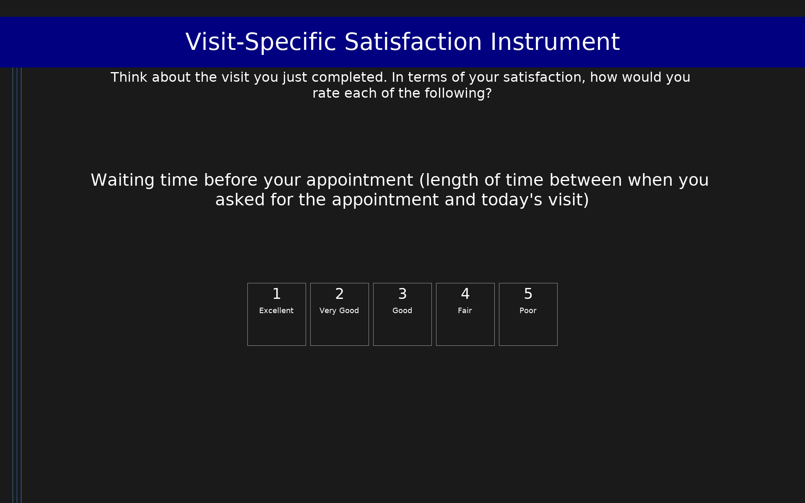

# Visit-Specific Satisfaction Instrument (VSQ-9)

9-item measure of patient satisfaction with a specific outpatient visit, covering access to care (items 1–4), interaction with the provider (items 5–8), and overall visit satisfaction (item 9). Scores are transformed to a 0–100 scale; higher scores indicate greater satisfaction.

## Overview

- **Code:** `VSQ9`
- **Items:** 0
- **Languages:** en
- **Version:** 1.0
- **License:** Public Domain (RAND Corporation)

## Dimensions

| ID | Name | Description |
|----|------|-------------|
| `access` | Access to Care | Satisfaction with access-related aspects of the visit (items 1–4): waiting time before appointment, getting through by phone, convenience of location, and availability of the appointment. |
| `visit` | Visit Quality | Satisfaction with the direct provider interaction (items 5–8): time spent waiting at the office, time spent with the doctor, explanation of what was done, and technical skills. |
| `manner` | Personal Manner | Satisfaction with the personal manner of the provider (item 8 in some scorings; here item 8 is technical skills and item 9 is personal manner — see note). In the standard VSQ-9 composite, all 9 items are averaged. |
| `composite` | Composite Score | Mean of all 9 items transformed to a 0–100 scale: ((mean − 1) / 4) × 100. Higher scores indicate greater satisfaction. |

## Questions

## Scoring

- **access**: mean (4 items)
  - Mean of items 1–4 (raw range 1–5). Transform to 0–100: ((mean − 1) / 4) × 100.
- **visit**: mean (4 items)
  - Mean of items 5–8 (raw range 1–5). Transform to 0–100: ((mean − 1) / 4) × 100.
- **composite**: mean (9 items)
  - Mean of all 9 items (raw range 1–5). Transform to 0–100: ((mean − 1) / 4) × 100. Higher scores indicate greater satisfaction.

## Citation

Rubin, H. R., Gandek, B., Rogers, W. H., Kosinski, M., McHorney, C. A., & Ware, J. E. (1993). Patients' ratings of outpatient visits in different practice settings: Results from the Medical Outcomes Study. JAMA, 270(7), 835–840. https://doi.org/10.1001/jama.1993.03510070069036

**URL:** https://www.rand.org/health-care/surveys_tools/vsq9.html

## Files

- `VSQ9.en.json`
- `VSQ9.json`
- `screenshot.png`

---
*This README was auto-generated by `tools/generate_readmes.py`.*
