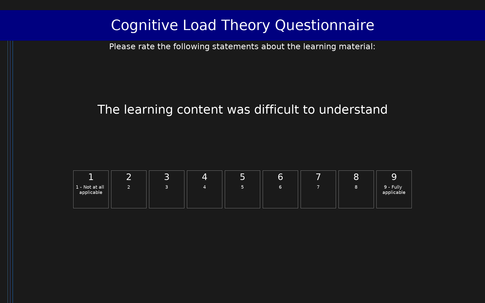

# Cognitive Load Theory Questionnaire (CLT)

15-item scale measuring three types of cognitive load during learning

## Overview

- **Code:** `clt`
- **Items:** 0
- **Languages:** de, en
- **Version:** 1.0
- **License:** CC BY 4.0

## Dimensions

| ID | Name | Description |
|----|------|-------------|
| `ICL` | Intrinsic Cognitive Load | Cognitive load imposed by the inherent difficulty of the learning content |
| `ECL` | Extraneous Cognitive Load | Cognitive load imposed by the design of the learning material |
| `GCL` | Germane Cognitive Load | Cognitive load associated with actively processing and understanding the material |

## Questions

## Scoring

- **ICL**: mean_coded (5 items)
  - Mean intrinsic cognitive load (1-9 scale)
- **ECL**: mean_coded (5 items)
  - Mean extraneous cognitive load (1-9 scale)
- **GCL**: mean_coded (5 items)
  - Mean germane cognitive load (1-9 scale)

## Citation

Krieglstein, F., Beege, M., Rey, G. D., Sanchez-Stockhammer, C., & Schneider, S. (2023). Development and validation of a theory-based questionnaire to measure different types of cognitive load. Educational Psychology Review, 35(1), 37. https://doi.org/10.1007/s10648-023-09738-0

**URL:** https://doi.org/10.1007/s10648-023-09738-0

## Files

- `README.md`
- `clt.de.json`
- `clt.en.json`
- `clt.json`
- `screenshot.png`

---
*This README was auto-generated by `tools/generate_readmes.py`.*
