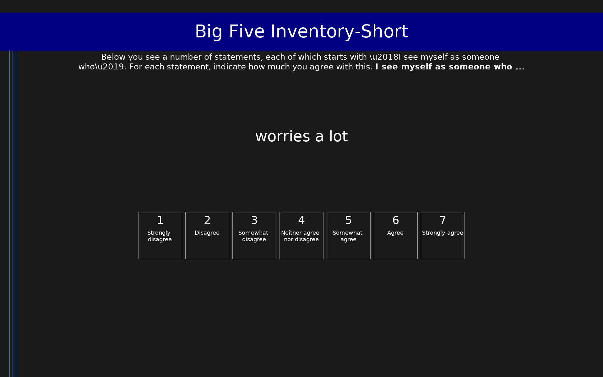

# Big Five Inventory-Short (BFI-S)

15-item short measure of the Big Five personality traits (3 items per trait). Scored as mean per dimension on a 1-7 scale.

## Overview

- **Code:** `BFIS`
- **Items:** 0
- **Languages:** en
- **Version:** 1.0
- **License:** CC BY-NC

## Dimensions

| ID | Name | Description |
|----|------|-------------|
| `openness` | Openness |  |
| `conscientiousness` | Conscientiousness |  |
| `extroversion` | Extroversion |  |
| `agreeableness` | Agreeableness |  |
| `neuroticism` | Neuroticism |  |

## Questions

## Scoring

- **openness**: mean_coded (3 items)
- **conscientiousness**: mean_coded (3 items)
- **extroversion**: mean_coded (3 items)
- **agreeableness**: mean_coded (3 items)
- **neuroticism**: mean_coded (3 items)

## Citation

Lang, F. R., John, D., Ludtke, O., Schupp, J., & Wagner, G. G. (2011). Short assessment of the Big Five: Robust across survey methods except telephone interviewing. Behavior Research Methods, 43(2), 548-567. https://doi.org/10.3758/s13428-011-0066-z

**URL:** https://doi.org/10.3758/s13428-011-0066-z

## Files

- `BFIS.en.json`
- `BFIS.en.json~`
- `BFIS.json`
- `README.md`
- `screenshot.png`

---
*This README was auto-generated by `tools/generate_readmes.py`.*
