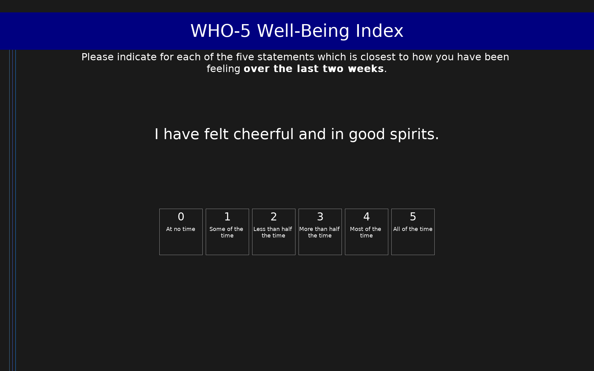

# WHO-5 Well-Being Index (WHO-5)

5-item measure of subjective well-being over the past 2 weeks. Raw score 0-25; percentage score (0-100) = raw score x 4. Scores of 50 or below suggest low mood warranting further assessment.

## Overview

- **Code:** `WHO5`
- **Items:** 0
- **Languages:** en
- **Version:** 1.0
- **License:** CC BY-NC-SA 3.0 IGO

## Dimensions

| ID | Name | Description |
|----|------|-------------|
| `wellbeing` | Well-Being |  |

## Questions

## Scoring

- **wellbeing**: sum_coded (5 items)
  - Raw sum of items (0-25). Percentage well-being score = raw x 4 (0-100). Scores <=50 suggest possible depression.

## Citation

Topp, C. W., Ostergaard, S. D., Sondergaard, S., & Bech, P. (2015). The WHO-5 Well-Being Index: A systematic review of the literature. Psychotherapy and Psychosomatics, 84(3), 167-176. https://doi.org/10.1159/000376585

**URL:** https://www.who.int/publications/i/item/WHO-ICD-MNH-98.1-Rev2

## Files

- `README.md`
- `WHO5.en.json`
- `WHO5.json`
- `screenshot.png`

---
*This README was auto-generated by `tools/generate_readmes.py`.*
